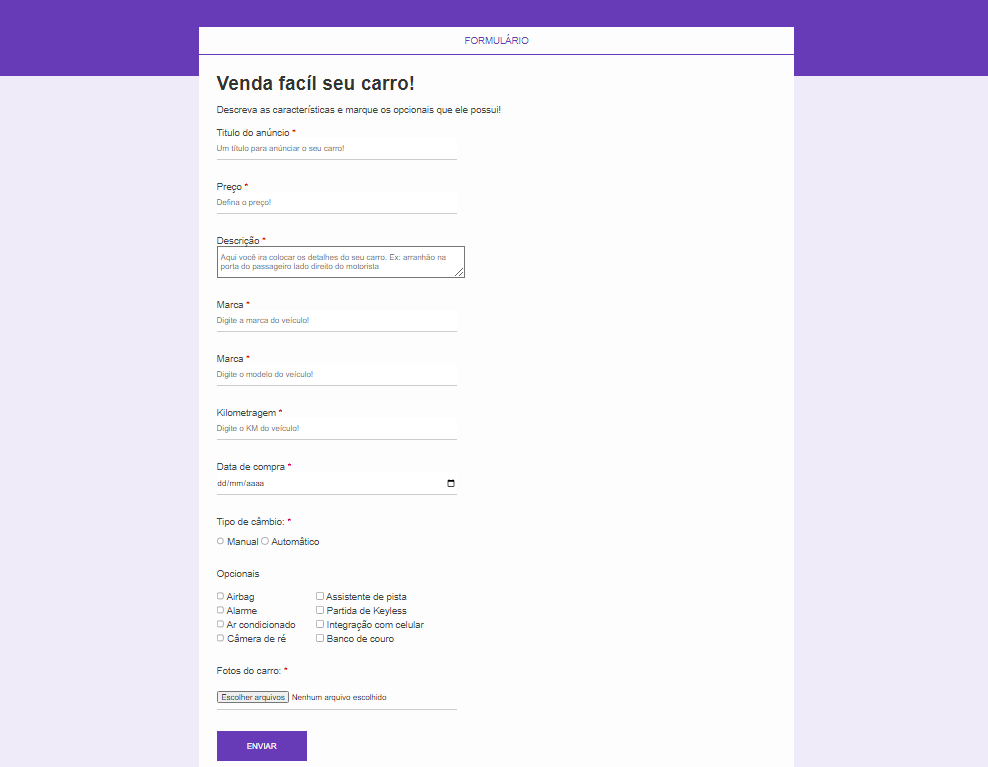

# Formacao-FrontEnd-CSS-JAVASCRIPT-REACT

    <h2 style="text-align: center;">Projeto formulário</h2>
    <h4>Nesse projeto foi criado um formulário de cadastro de carro, usando tags de formulários avançado<h4>
    

    

    <h2>🛠 Tecnologias</h2>
    <ul>
        <li>
            <h4>HTML</h4>
        </li>
        <li>
            <h4>CSS</h4>
        </li>
    </ul>

## 📲 CONTATO

- 💻uevetonsp89@gmail.com
- 💻https://www.linkedin.com/in/ueveton-soares-pereira-99005375/